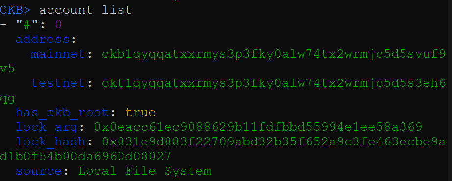
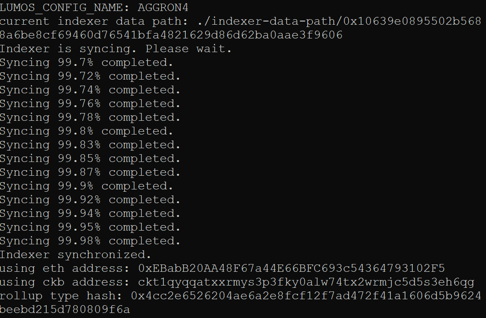
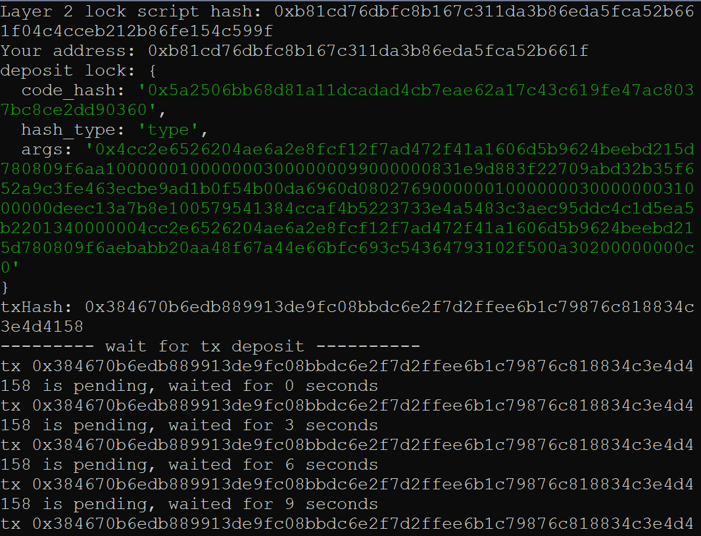
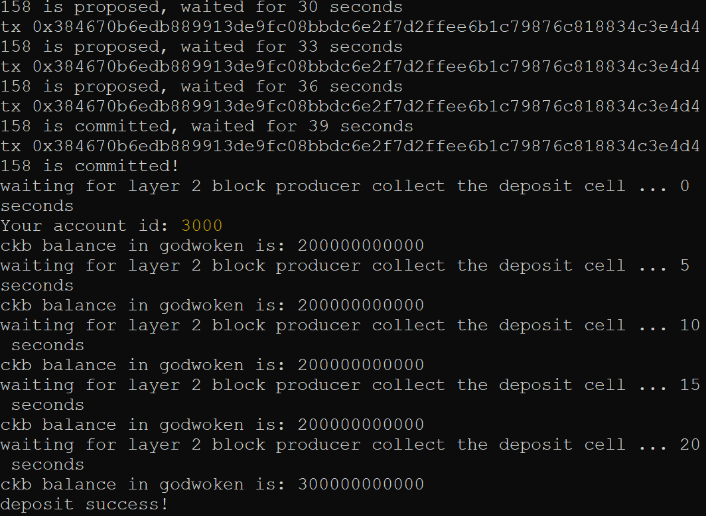

# Gitcoin: 1) Create a Godwoken Account on the EVM Layer 2 Testnet

### 1. Create and Fund an Account with CKBytes on Layer 1

#### List account

#### L1 deposit on block explorer
https://explorer.nervos.org/aggron/address/ckt1qyqqatxxrmys3p3fky0alw74tx2wrmjc5d5s3eh6qg

### 2. Deposit some CKBytes on Layer 2

