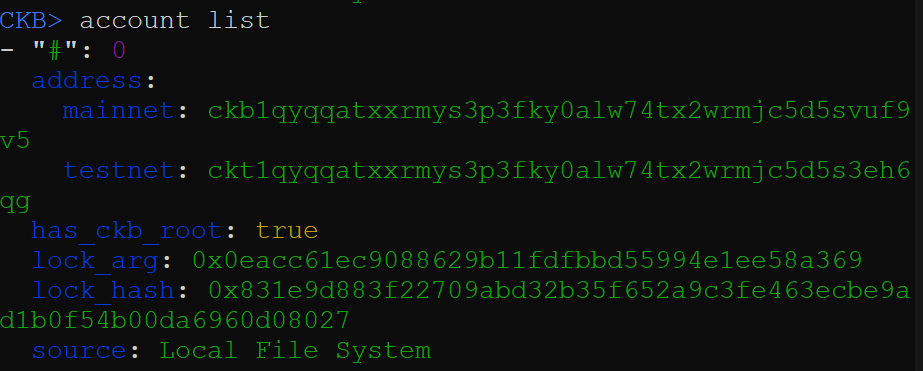
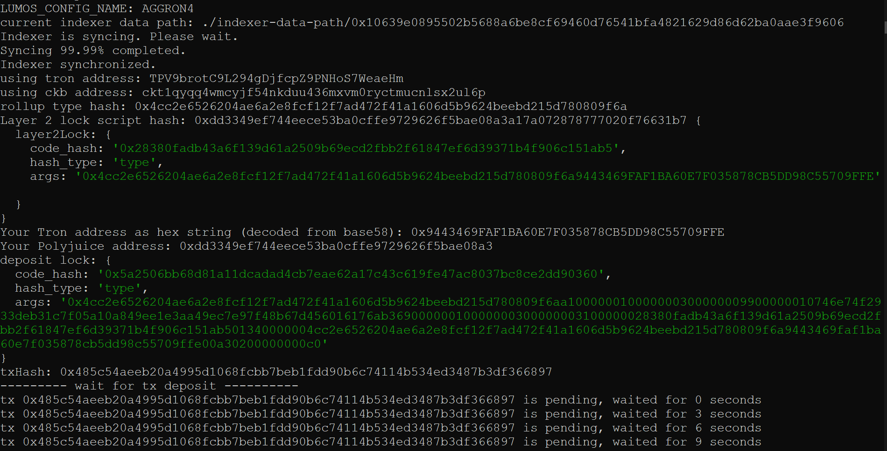
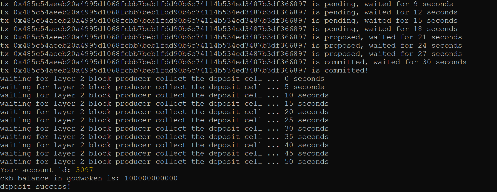
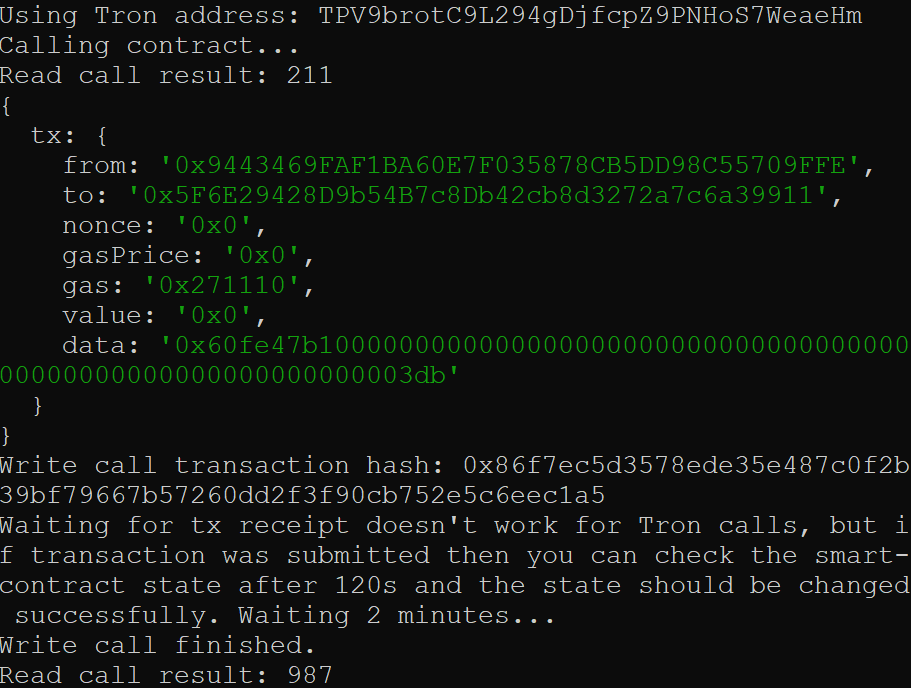

### Screenshot of accounts in ckb-cli



### Layer 1 address on the Testnet Explorer
https://explorer.nervos.org/aggron/address/ckt1qyqqatxxrmys3p3fky0alw74tx2wrmjc5d5s3eh6qg

### Screenshot of deposit to L2 Tron Account


### Screenshot of smart contract calls



### Contract call transaction hash
0x86f7ec5d3578ede35e487c0f2b39bf79667b57260dd2f3f90cb752e5c6eec1a5

### Contract address
0x5F6E29428D9b54B7c8Db42cb8d3272a7c6a39911

### Contract ABI
```json
[
  {
    "inputs": [],
    "stateMutability": "payable",
    "type": "constructor"
  },
  {
    "inputs": [
      {
        "internalType": "uint256",
        "name": "x",
        "type": "uint256"
      }
    ],
    "name": "set",
    "outputs": [],
    "stateMutability": "payable",
    "type": "function"
  },
  {
    "inputs": [],
    "name": "get",
    "outputs": [
      {
        "internalType": "uint256",
        "name": "",
        "type": "uint256"
      }
    ],
    "stateMutability": "view",
    "type": "function"
  }
];
```

### Tron Address
TPV9brotC9L294gDjfcpZ9PNHoS7WeaeHm